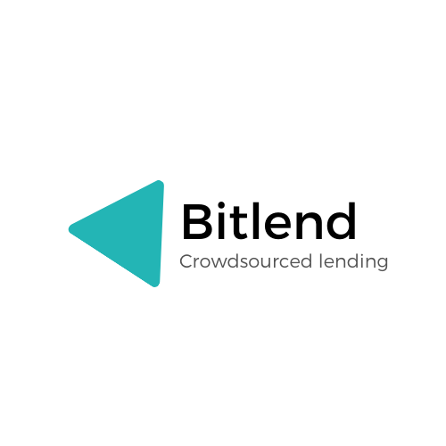

	

Bitlend
---

An app for supporting entrepreneurs and organizations by giving donations and loans through your FireTV 

Pitch deck: 
https://docs.google.com/presentation/d/11frYalIAV22de-3VrGX8ORFQNL3WzcHYDTLffU5zWhY/edit?usp=sharing

Key themes:
Entrepreneurs and businesses are facing a tough economic climate.
Banks unwilling to give loans. Too risky credit environment from COVID
Crowdsource for businesses (international, without regard to borders)  through a TV application
No fees, no middle men. App requires no user account.

Vision is to have this app running in TV's and available to all amazon FireTV users across the world to discover projects.

### Building the project
* Import into android studio
* Connect to a FireTV supported device or emulator with supported sdk version > 22.
* Build and install application to device

